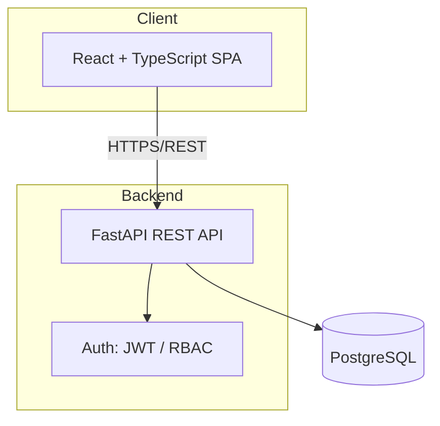
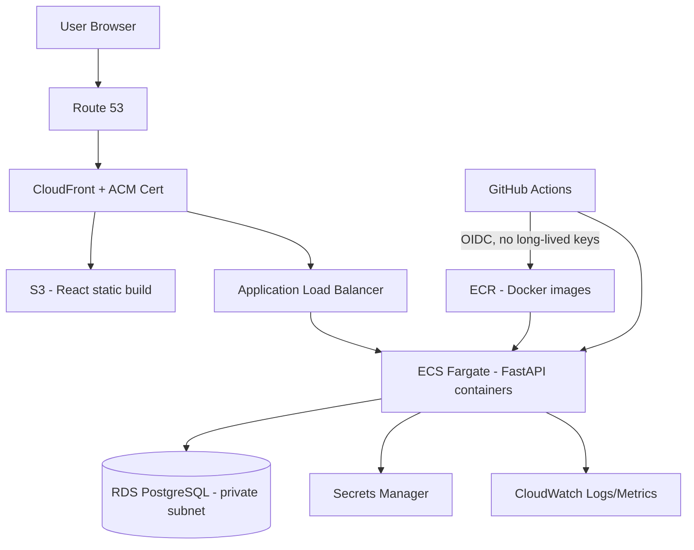

# Architecture

> Part of **[PlantPulse](../README.md)** — the Ethanol Plant Operations & Asset Management Platform. Self-developed portfolio project — see root README for the honesty/status disclaimer.

## Table of Contents

- [Business Problem](#business-problem)
- [Functional Requirements](#functional-requirements)
- [Non-Functional Requirements](#non-functional-requirements)
- [System Architecture](#system-architecture)
- [AWS Architecture (Target State)](#aws-architecture-target-state)
- [Technology Selection](#technology-selection)
- [Database Entities](#database-entities-overview)
- [Security Model Overview](#security-model-overview)
- [Risks & Limitations](#risks--limitations)

---

## Business Problem

Ethanol plants run large numbers of physical assets across multiple process areas (feedstock handling, fermentation, distillation, dehydration, utilities, storage, electrical). In many mid-size plants, asset records and maintenance tracking live in spreadsheets or paper logs:

- No single source of truth for what assets exist, where they are, and what condition they're in
- Preventive maintenance is missed or delayed with no scheduling/alerting system
- Breakdown maintenance has no structured work-order trail, losing root-cause history
- No RBAC — anyone with the spreadsheet can edit anything
- No audit trail for who changed what
- No management visibility into open work orders, overdue maintenance, or downtime trends

## Functional Requirements

| # | Requirement |
|---|---|
| F1 | Register, view, update, retire assets with category, location, ownership, vendor, purchase/warranty/AMC data |
| F2 | Track asset lifecycle status and full status-change history |
| F3 | Attach documents (manuals, warranty certs) to assets |
| F4 | Create preventive maintenance plans/schedules per asset or category |
| F5 | Raise work orders (preventive, corrective, breakdown), assign technicians, track status |
| F6 | Record maintenance completion, parts used, downtime caused |
| F7 | Manage spare parts / inventory with stock transactions |
| F8 | Role-based dashboards (KPIs vary by role) |
| F9 | RBAC-enforced access to every module |
| F10 | Full audit log of create/update/delete on key entities |
| F11 | Authentication via JWT (Cognito integration later) |
| F12 | Search/filter/report across assets and work orders |

## Non-Functional Requirements

| # | Requirement |
|---|---|
| N1 | Containerized (Docker) — runs identically on laptop and AWS |
| N2 | Infrastructure fully defined as Terraform code, no manual console changes in "real" environments |
| N3 | CI on every PR: lint, tests, build; CD on merge: image push + deploy |
| N4 | Secrets never committed — env vars locally, AWS Secrets Manager in cloud |
| N5 | Least-privilege IAM everywhere; app RBAC kept conceptually separate from AWS IAM |
| N6 | Structured logs + CloudWatch metrics + health checks |
| N7 | Cost-aware: destroyable environments, free-tier-first choices, documented shutdown procedure |
| N8 | Reasonable performance (sub-second typical API responses at demo scale) |
| N9 | HTTPS everywhere in cloud (ACM certs via CloudFront/ALB) |
| N10 | Database migrations versioned via Alembic, never manual schema edits |

## System Architecture

Three-tier: presentation (React SPA) → application (FastAPI REST API, stateless, containerized) → data (PostgreSQL). Local dev runs all three via Docker Compose; cloud deploy runs the same containers on ECS Fargate behind an ALB, with a managed RDS instance.

## AWS Architecture (Target State)

Built incrementally starting Phase 13. Each service below will get its own why/alternatives/cost/security writeup in `docs/AWS_ARCHITECTURE.md` before it's provisioned.

Key design decisions:

- **VPC** with public subnets (ALB, NAT) and private subnets (ECS tasks, RDS) for network isolation
- **ECS Fargate** over EC2/EKS — no server management, right complexity for a portfolio project while still teaching real container orchestration
- **RDS PostgreSQL** in a private subnet, no public access, credentials in Secrets Manager
- **S3 + CloudFront** for the React static build
- **ECR** for Docker images; **GitHub Actions OIDC** to authenticate to AWS (no static access keys)
- **CloudWatch** for logs/metrics/alarms; **CloudTrail** for AWS API audit (distinct from the application's own audit log)
- **Cognito** as a later optional upgrade over JWT-in-DB, to demonstrate managed identity too

## Technology Selection

| Layer | Choice | Why |
|---|---|---|
| Frontend | React + TypeScript | Industry-standard, strong interview relevance, type safety |
| UI | Component library (decided in Phase 6) | Faster, professional-looking dashboards |
| Backend | Python FastAPI | Async, typed, auto OpenAPI docs, fast REST API development |
| ORM/Migrations | SQLAlchemy + Alembic | Standard FastAPI pairing, versioned schema changes |
| Database | PostgreSQL | Relational data fits assets/maintenance well; strong RDS support |
| Auth | JWT now, Cognito optional later | Learn both self-managed and managed identity approaches |
| Containers | Docker + Docker Compose | Local parity with cloud, teaches container fundamentals |
| IaC | Terraform | Cloud-agnostic, most interview-relevant IaC tool |
| CI/CD | GitHub Actions | Free for personal repos, native to GitHub, OIDC support |
| Cloud | AWS | Matches existing AWS background |

## Database Entities (Overview)

`users`, `roles`, `permissions`, `role_permissions`, `plants`, `areas`, `asset_categories`, `assets`, `vendors`, `asset_documents`, `asset_lifecycle_history`, `maintenance_plans`, `maintenance_schedules`, `work_orders`, `maintenance_records`, `spare_parts`, `inventory`, `inventory_transactions`, `downtime_records`, `audit_logs`

All tables include `created_at`, `updated_at`, and (where relevant) `created_by` / `updated_by` audit columns. Full ER diagram and constraints land in `docs/DATABASE.md` during Phase 4.

## Security Model Overview

- **Application RBAC** (who can do what inside the app): enforced server-side in FastAPI via dependency-based guards, backed by `roles`/`permissions` tables — not just hidden in the UI.
- **AWS IAM** (who/what can call which AWS APIs): least-privilege roles per ECS task, GitHub Actions OIDC role scoped to only what CI/CD needs, no human or service uses long-lived AWS access keys.

These two are deliberately kept conceptually separate and documented that way — a common interview point of confusion. Full detail in `SECURITY.md` (Phase 7 for app-level, Phase 20 for infra hardening).

## Risks & Limitations

- **Scope risk** — large system; managed via strict phase gating
- **Cost risk** — mitigated by a cost checklist and `terraform destroy` discipline (see `docs/COST.md`)
- **Domain-accuracy risk** — domain modeling stays at the operations/IT level (equipment records), not process engineering or industrial control
- **Honesty** — always labeled a self-developed/personal project; never implies employer production usage
- **Two-laptop sync** — mitigated by a disciplined Git branch/PR workflow (documented in `CONTRIBUTING.md`, Phase 11)
